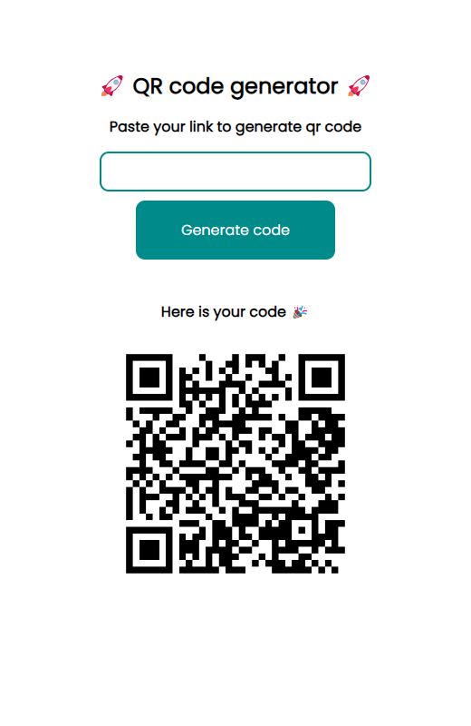

# QR Code Generator

### Description

This is a simple python project web project. Just paste any link you want to convert to a QR Code and press the button




___

### How to run this project
For this you can just start main.py file with terminal command
```
python main.py
```
from the project directory

___

### Stack
Project was made with Flask. It is python web framework that renders html page
<br>
1. Flask - python web framework for page generation
2. qrcode -  python library for generating qr codes
3. BytesIO from io - was used as memory buffer
4. b64encode from base64 -  for encoding qrcode

 